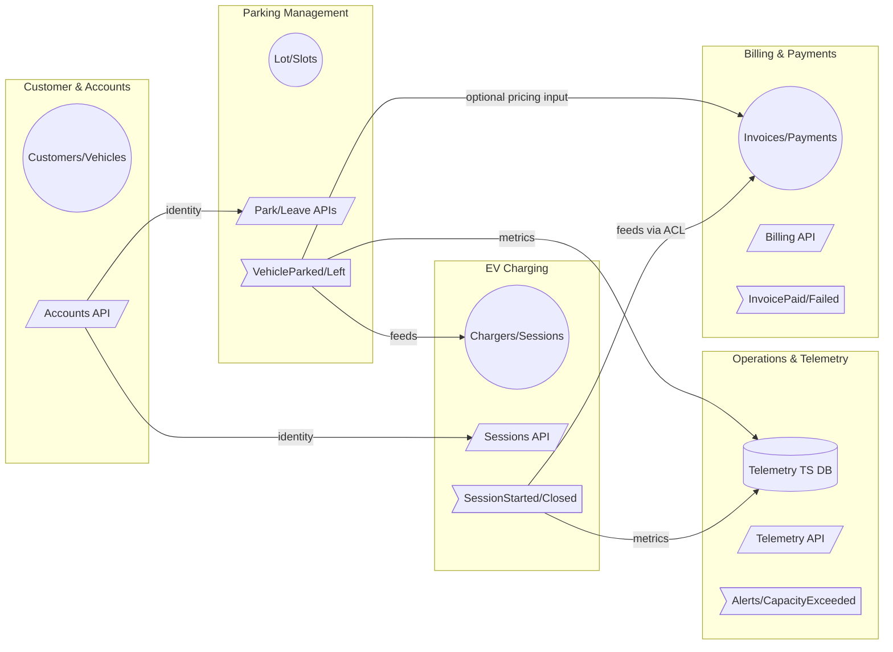

# DDD Bounded Contexts & Context Map

This document defines the **bounded contexts** for the Parking Lot system as we scale beyond a single-service app.
It also includes a **context map** (Mermaid) and a brief contract summary per context.

---

## Overview of Contexts

We split the domain into five contexts aligned to stable business capabilities:

1. **Parking Management** *(core domain)*  
   Allocation and state of slots (ICE/EV), park/leave workflows, finders, persistence of lot state.

2. **EV Charging**  
   Charger inventory, session lifecycle (start/stop), charge metrics, tariffs.

3. **Billing & Payments**  
   Pricing, invoice generation, payment capture, refunds/reversals.

4. **Customer & Accounts**  
   Drivers, vehicles registered to accounts, authentication/authorization.

5. **Operations & Telemetry**  
   Device telemetry (chargers), health checks, capacity and utilization metrics, alerts.

---

## Context Responsibilities & Data Ownership

### 1) Parking Management (Core)
- **Owns**: Lots, Slots, ParkingTickets (if introduced), in-lot allocation history.
- **Decisions**: Which slot can be occupied; validity of park/leave; slot-level invariants.
- **APIs** (sketch):  
  - `POST /lots/{id}/park`  
  - `POST /lots/{id}/leave`  
  - `GET /lots/{id}/status`  
- **Publishes events**: `VehicleParked`, `VehicleLeft`.
- **Consumes events** (optional): `ChargingSessionClosed` (for cross-reporting), `InvoicePaid` (for ticket exits).

### 2) EV Charging
- **Owns**: Chargers, ChargingSessions, Tariffs, MeterReadings.
- **Decisions**: Can a session start; what rate applies; when to stop automatically.
- **APIs**:  
  - `POST /sessions` (start)  
  - `PATCH /sessions/{id}/stop`  
  - `GET /chargers/{id}` (status)  
- **Publishes**: `ChargingSessionStarted`, `ChargingSessionClosed`, `TariffChanged`.
- **Consumes**: `VehicleParked` (to associate a session with a parked vehicle/slot).

### 3) Billing & Payments
- **Owns**: Invoices, LineItems (parking, charging), Payments, Refunds.
- **Decisions**: How to price; tax rules; capture/void; invoice state machine.
- **APIs**:  
  - `POST /invoices`  
  - `GET /invoices/{id}`  
  - `POST /invoices/{id}/capture`  
- **Publishes**: `InvoiceCreated`, `InvoicePaid`, `PaymentFailed`.
- **Consumes**: `ChargingSessionClosed` (to price energy) and optionally `VehicleLeft` (to price parking).

### 4) Customer & Accounts
- **Owns**: Customers, Credentials, Vehicles (as registered assets), Roles/Permissions.
- **Decisions**: Identity, access control, vehicle-to-customer linkage.
- **APIs**:  
  - `POST /customers`  
  - `GET /customers/{id}`  
  - `GET /customers/{id}/vehicles`  
- **Publishes**: `CustomerCreated`, `VehicleLinked`.
- **Consumes**: None required for MVP (others read via API).

### 5) Operations & Telemetry
- **Owns**: Time-series telemetry (charger metrics), Alerts, SLOs, Capacity utilization.
- **Decisions**: Trigger alerts; quantify availability; trend analysis.
- **APIs**:  
  - `GET /metrics/chargers/{id}`  
  - `GET /metrics/occupancy`  
- **Publishes**: `DeviceUnhealthy`, `CapacityThresholdExceeded`.
- **Consumes**: `ChargingSessionStarted/Closed`, `VehicleParked/Left` (for derived metrics).

---

## Context Map (Relationships)

- **Upstream/Downstream**: Parking is an *Upstream* to EV Charging (parking allocates physical slots used by charging).  
- **Conformist vs ACL**: Billing uses an **Anti-Corruption Layer (ACL)** to translate Parking/Charging events into invoice line items.  
- **Shared Kernel**: Ubiquitous terms (`regnum`, `slot_ui`) are **not shared** as code; they are **shared language** only—each context owns its models and DB.

### Diagram

**Notes**
- **ACL**: Billing translates domain events into its own invoice model; avoids leaking Parking/Charging internals.  
- **Per-service DBs**: Each context owns its database (Postgres for Parking/Billing/Accounts; time-series for Ops; Charging may store sessions in Postgres + metrics in TS).  
- **Contracts**: See Step 28 for API and event payload sketches.

---

## Contracts Table (Brief)

| Context | Primary APIs | Events Out | Events In | DB |
|---|---|---|---|---|
| Parking | `POST /lots/{id}/park`, `POST /lots/{id}/leave`, `GET /lots/{id}/status` | `VehicleParked`, `VehicleLeft` | `ChargingSessionClosed` (opt), `InvoicePaid` (opt) | Postgres |
| EV Charging | `POST /sessions`, `PATCH /sessions/{id}/stop`, `GET /chargers/{id}` | `ChargingSessionStarted`, `ChargingSessionClosed` | `VehicleParked` | Postgres (+ TS) |
| Billing | `POST /invoices`, `GET /invoices/{id}`, `POST /invoices/{id}/capture` | `InvoiceCreated`, `InvoicePaid` | `ChargingSessionClosed`, `VehicleLeft` | Postgres |
| Accounts | `POST /customers`, `GET /customers/{id}` | `CustomerCreated`, `VehicleLinked` | — | Postgres |
| Ops/Telemetry | `GET /metrics/*` | `DeviceUnhealthy`, `CapacityThresholdExceeded` | Parking/Charging events | TS (e.g., Timescale/Influx) |

---

## Evolution Path

- Start with Parking (existing), integrate Charging via events and read models.  
- Add Billing after event schema stabilizes; begin with Conformist API, then introduce ACL translation if models diverge.  
- Add Ops as read-only projections first; layer alerts later.
