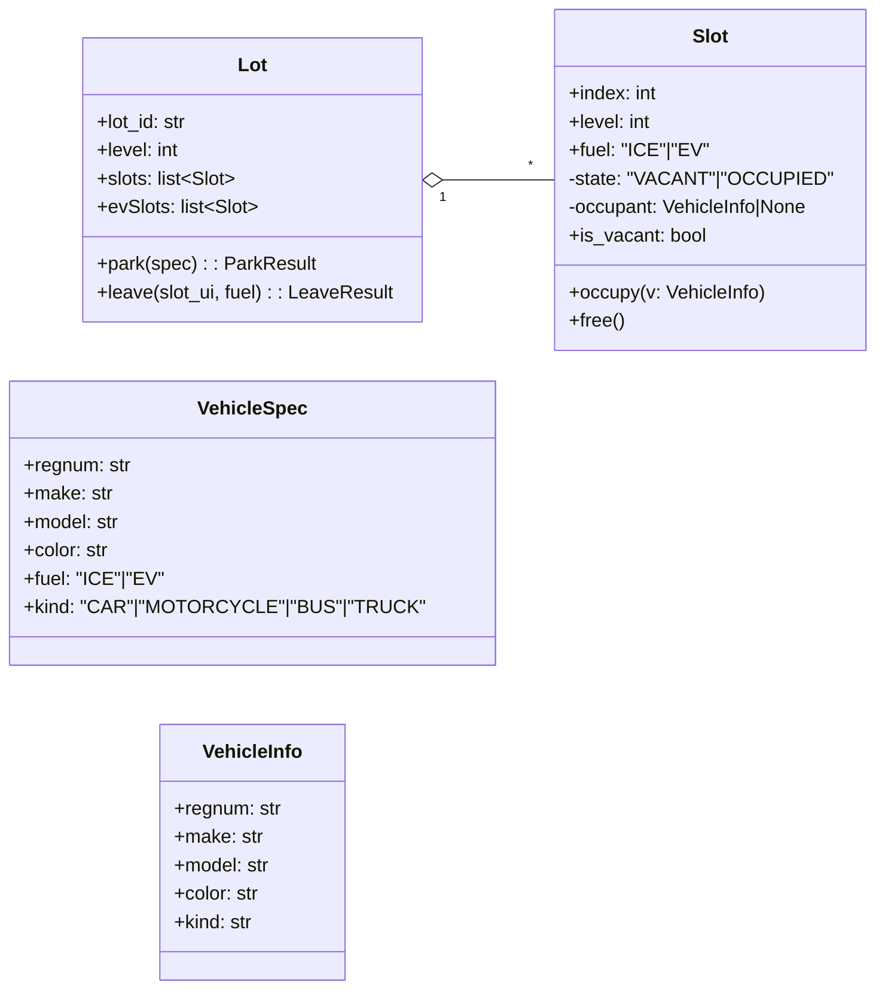
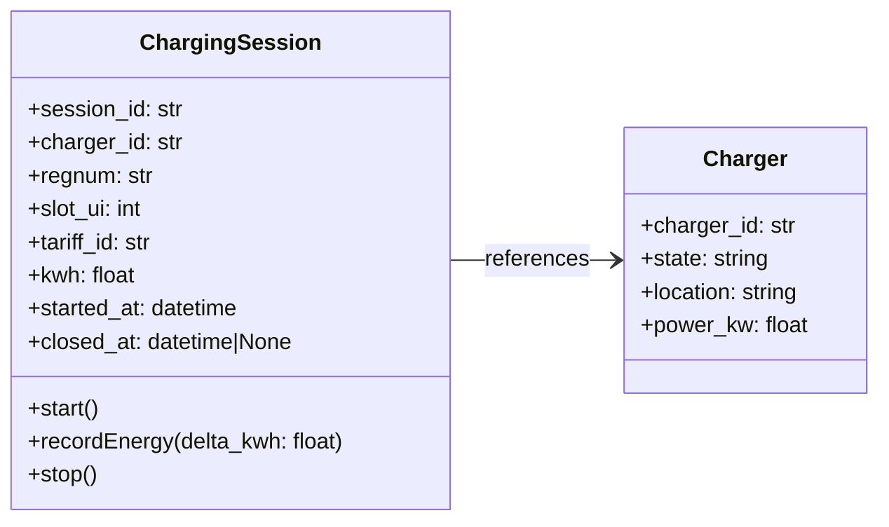
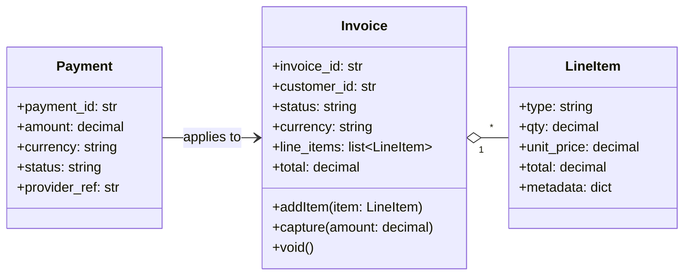
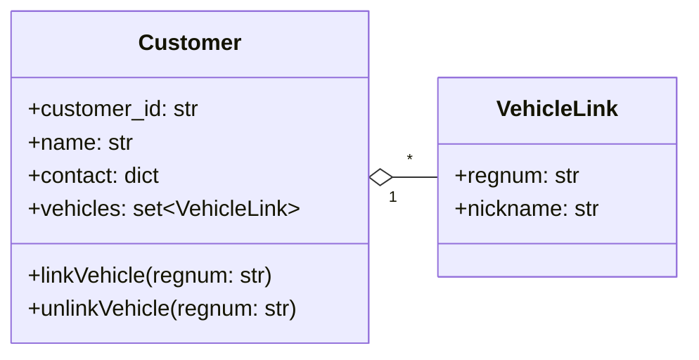
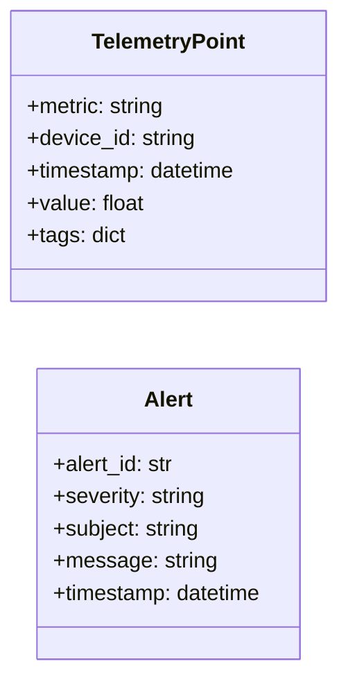

# DDD Domain Models (Entities, Value Objects, Aggregates)

This document defines **entities**, **value objects**, and **aggregates** for each bounded context. It also spells out key **invariants**, **commands/events**, and **consistency** rules so the models are implementable and testable.

> Notation: *Aggregate Root* underlined; VO = Value Object; E = Entity.

---

## Parking Management (Core Domain)

### Aggregate: __Lot__
- **Identity**: `lot_id`
- **State**: metadata (name, address optional), `levels: list[int]` or single `level` for MVP, **`slots`** (collection of `Slot` entities for ICE and EV pools).
- **Invariants**
  1. Slot indices are unique within `(lot_id, level, pool)`.
  2. UI slot number is **1-based**: `slot_ui = index + 1`.
  3. A slot is either `VACANT` or `OCCUPIED`, never both; transitions are only `VACANT -> OCCUPIED` via `occupy(v)` and `OCCUPIED -> VACANT` via `free()`.
  4. EV vehicles must occupy an **EV** slot; ICE vehicles must occupy an **ICE** slot.
- **Commands**
  - `ParkVehicle(spec: VehicleSpec) -> ParkResult`
  - `LeaveSlot(slot_ui: int, fuel: Fuel) -> LeaveResult`
- **Events**
  - `VehicleParked {lot_id, level, slot_ui, regnum, fuel, kind, make, model, color}`
  - `VehicleLeft {lot_id, level, slot_ui, regnum, fuel}`

#### Entity: Slot (E)
- **Identity**: `(lot_id, level, pool, index)`; exposes `slot_ui`
- **Attributes**: `fuel: "ICE"|"EV"`, `state: VACANT|OCCUPIED`, `occupant: VehicleInfo|None`
- **Operations**: `occupy(VehicleInfo)`, `free()`
- **Invariants**
  - Cannot `occupy` if state is `OCCUPIED`
  - Cannot `free` if state is `VACANT`
  - `occupant.regnum` unique across occupied slots in same lot (optional business rule)

#### Value Object: VehicleSpec (VO)
- **Fields**: `regnum, make, model, color, fuel("ICE"|"EV"), kind("CAR"|"MOTORCYCLE"|"BUS"|"TRUCK")`
- **Notes**: UI/CLI input to the domain; maps to concrete class in factory.

#### Value Object: VehicleInfo (VO)
- **Fields**: `regnum, make, model, color, kind` (+ `charge` for EV if locally tracked)
- **Notes**: Snapshot of relevant vehicle fields persisted within Parking domain. Ownership of canonical Vehicle is in **Accounts**.

#### Read Models (not aggregates)
- `StatusRow`, `EvStatusRow`, `EvChargeRow` for UI/reporting.



**Consistency**: Parking decisions are **strongly consistent** within a Lot transaction (allocate/free one slot atomically).

---

## EV Charging

### Aggregate: __ChargingSession__
- **Identity**: `session_id`
- **State**: `charger_id`, `regnum` (optional but recommended), `slot_ui` (for correlation), `tariff_id`, `kwh: decimal`, `started_at`, `closed_at`
- **Invariants**
  1. A session must reference an **existing** charger.
  2. A charger may have **at most one OPEN** session.
  3. A CLOSED session is immutable except for settlement annotations.
- **Commands**
  - `StartSession(charger_id, regnum?, slot_ui?, tariff_id?) -> session_id`
  - `RecordEnergy(session_id, delta_kwh)`
  - `StopSession(session_id) -> {kwh, duration}`
- **Events**
  - `ChargingSessionStarted {session_id, charger_id, regnum?, slot_ui?, tariff_id}`
  - `ChargingSessionClosed {session_id, charger_id, regnum?, kwh, duration, tariff_id}`

#### Entity: Charger (E)
- **Identity**: `charger_id`
- **Attributes**: `state: AVAILABLE|BUSY|OUT_OF_SERVICE`, `location`, `power_kw`
- **Invariants**: If `state=BUSY`, there must be one OPEN session referencing this charger.

#### Value Objects
- **Tariff** (VO): pricing parameters at the time of rating (captured or referenced by `tariff_id`).
- **MeterReading** (VO): `(timestamp, kwh_total)`; used to derive deltas.



**Consistency**: Charging enforces **strong consistency** per charger for session lifecycle; energy increments can be idempotent events.

---

## Billing & Payments

### Aggregate: __Invoice__
- **Identity**: `invoice_id`
- **State**: `customer_id`, `status: OPEN|PAID|VOID`, `currency`, `line_items: list~LineItem~`, `totals`
- **Invariants**
  1. `total = sum(line_items.total)`
  2. Status transitions: `OPEN -> PAID` (only with sufficient payments), `OPEN -> VOID` (admin), `PAID` is final.
  3. LineItem is immutable after invoice is PAID.
- **Commands**
  - `CreateInvoice(customer_id, currency) -> invoice_id`
  - `AddLineItem(invoice_id, LineItem)` (only if `OPEN`)
  - `CapturePayment(invoice_id, amount)`
  - `VoidInvoice(invoice_id)`
- **Events**
  - `InvoiceCreated {invoice_id, customer_id}`
  - `InvoicePaid {invoice_id, total}`
  - `PaymentFailed {invoice_id, amount}`

#### Value Object: LineItem (VO)
- **Fields**: `type: PARKING|CHARGING|FEE`, `qty`, `unit_price`, `total`, `metadata` (slot details, kWh, timestamps)

#### Entity: Payment (E)
- **Identity**: `payment_id`
- **Fields**: `amount`, `currency`, `status: AUTHORIZED|CAPTURED|FAILED|REFUNDED`, `provider_ref`
- **Rules**: Payments apply to a single invoice; overpayment disallowed (or creates credit note).



**Consistency**: Financial invariants are **strongly consistent** within an invoice transaction; payments may be processed asynchronously but invoice state changes atomically.

---

## Customer & Accounts

### Aggregate: __Customer__
- **Identity**: `customer_id`
- **State**: name/contact, **`vehicles: set~VehicleLink~`**
- **Commands**
  - `CreateCustomer(...)`
  - `LinkVehicle(regnum)` / `UnlinkVehicle(regnum)`
- **Events**
  - `CustomerCreated {customer_id}`
  - `VehicleLinked {customer_id, regnum}`

#### Value Object: VehicleLink (VO)
- **Fields**: `regnum`, optional `nickname`, proof of ownership if required.



**Consistency**: Vehicle links are consistent per customer; cross-context reads (Parking needing owner) should go via Accounts API or cached projection.

---

## Operations & Telemetry

### Non-aggregate, Event-Sourced Streams
- **TelemetryPoint** (VO): `(metric, device_id, ts, value, tags)`
- **Streams**: per device or per metric.
- **Aggregations**: read models (e.g., occupancy %, charger uptime) derived from Parking/Charging events plus device telemetry.
- **Alerts**: Rules evaluated on derived signals → `Alert` entity in Ops context.



**Consistency**: Eventually consistent projections; alerts run on near-real-time windows.

---

## Cross-Context Contracts (Summary)

| From | Event | To | Purpose |
|---|---|---|---|
| Parking | `VehicleParked / VehicleLeft` | Charging | Correlate sessions with physical occupancy and regnum |
| Charging | `ChargingSessionClosed` | Billing | Produce invoice line items for energy |
| Parking (opt) | `VehicleLeft` | Billing | Add parking-time line item |
| Accounts | `VehicleLinked` | Parking/Charging (read) | Attribution/permissions |
| Charging/Parking | events | Ops | Occupancy & availability metrics |

---

## JSON Sketches (Selected)

**VehicleParked event**
```json
{
  "event": "VehicleParked",
  "lot_id": "A1",
  "level": 1,
  "slot_ui": 3,
  "regnum": "ABC123",
  "fuel": "EV",
  "kind": "CAR",
  "make": "Tesla",
  "model": "Model 3",
  "color": "Blue",
  "ts": "2025-09-21T14:33:05Z"
}
```

**ChargingSessionClosed event**
```json
{
  "event": "ChargingSessionClosed",
  "session_id": "sess_9f2",
  "charger_id": "CH_12",
  "regnum": "ABC123",
  "kwh": 14.3,
  "duration_sec": 1860,
  "tariff_id": "T_STD",
  "ts": "2025-09-21T15:12:10Z"
}
```

**Invoice (aggregate state)**
```json
{
  "invoice_id": "inv_1001",
  "customer_id": "cust_77",
  "status": "OPEN",
  "currency": "USD",
  "line_items": [
    {"type": "PARKING", "qty": 2.0, "unit_price": 4.00, "total": 8.00, "metadata": {"lot_id":"A1"}},
    {"type": "CHARGING", "qty": 14.3, "unit_price": 0.25, "total": 3.575, "metadata": {"charger_id":"CH_12"}}
  ],
  "total": 11.575
}
```

---

## Consistency & Transactions

- **Parking**: cmd → validate → mutate `Lot`/`Slot` → emit event; atomic per slot.  
- **Charging**: per-charger command serialization (single OPEN session).  
- **Billing**: invoice mutations are transactional; payments settle invoice atomically.  
- **Ops**: projections are eventually consistent; alerts are idempotent.

---

## Testing Guidelines

1. **Aggregate tests**: verify invariants and state transitions (`Slot`, `ChargingSession`, `Invoice`).  
2. **Contract tests**: validate example event payloads & API responses.  
3. **Projection tests**: seed events → assert derived read models (e.g., occupancy %).  
4. **Error-path tests**: full pools, duplicate regnum, invalid slot numbers, stop session twice, capture on PAID invoice, etc.

---

## Notes

- Parking’s current implementation (service + Slot + factory) maps directly to this model.  
- As we split contexts into microservices, keep **per-service DBs** and exchange *events* or *API* calls instead of sharing tables.
